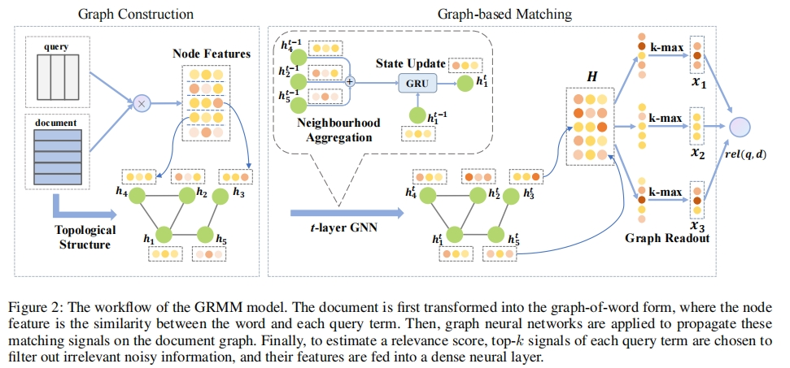

# GRMM



This is the code for the AAAI 2021 Paper: [A Graph-based Relevance Matching Model for Ad-hoc Retrieval](https://ojs.aaai.org/index.php/AAAI/article/view/16599).

## Usage


## Requirements


## Citation

Please cite our paper if you use the code:
```
@inproceedings{zhang2021graph,
  title={A graph-based relevance matching model for ad-hoc retrieval},
  author={Zhang, Yufeng and Zhang, Jinghao and Cui, Zeyu and Wu, Shu and Wang, Liang},
  booktitle={Proceedings of the AAAI Conference on Artificial Intelligence},
  volume={35},
  number={5},
  pages={4688--4696},
  year={2021}
}
```
